# HL FMA 2026 · 1/5-Scale Autonomous Vehicle


HL FMA 2026을 위해 제작한 1/5 스케일 자율주행 차량 프로젝트다. Ubuntu 22.04와 ROS 2 Humble에서 듀얼 안테나 RTK GNSS, 카메라, 2D LiDAR, 전역경로, 미션 FSM, 경로 추종, 안전 감독, NUCLEO-H723ZG 기반 차량 제어를 하나의 시스템으로 통합했다.

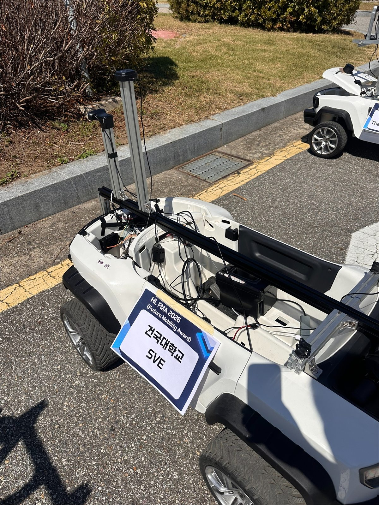

> 이 저장소는 팀 저장소 `yunny22/HL_KU`의 최종 대회 코드를 바탕으로 공개용 문서와 사진을 다시 구성한 포트폴리오 저장소다. 팀 전체 구현과 개인 참여 경험을 구분해 설명하며, 대회 완주·수상·입상을 주장하지 않는다.

[포트폴리오 상세 페이지](https://juuny0317-cmd.github.io/projects/hl-fma2026/) · [원본 팀 프로젝트](https://github.com/yunny22/HL_KU)

## 프로젝트 요약

| 항목 | 내용 |
| --- | --- |
| 플랫폼 | 1/5 스케일 전동 차량 |
| 주 컴퓨터 | Ubuntu 22.04 · ROS 2 Humble |
| 위치·방향 | UM982 · 듀얼 GNSS 안테나 · RTK/NTRIP · ENU |
| 인지 | 전방 카메라 · YOLO/OpenCV · RPLIDAR A3 |
| 경로·제어 | CSV 전역경로 · 미션 구간 · 전진 Stanley 100% · PI 속도 제어 |
| 임베디드 | NUCLEO-H723ZG · 조향각 폐루프 · watchdog |
| 구동 | MDD20A 구동모터 · MD10C 조향모터 |
| 현장 운용 | TUI 시나리오 선택 · Foxglove 상태/경로/FSM 모니터링 |

## 기여 범위와 공동 개발

### 제공 자료로 확인되는 개인 참여

- 1/5 스케일 차체를 분해하고 센서 지지대, 제어 보드, 전원 계통과 배선을 단계적으로 통합했다.
- NUCLEO-H723ZG, MDD20A, MD10C와 조향 위치 센서의 연결을 점검하고 구동·조향 명령의 방향과 피드백을 실차에서 확인했다.
- 듀얼 GNSS 안테나를 장착하고 RTK 상태 확인, datum 측정, waypoint 기록과 전역경로 현장 시험에 참여했다.
- TUI로 시험 시나리오를 선택하고 Foxglove로 경로, FSM, RTK 상태, 속도·조향·CTE를 확인하며 실외 통합 시험을 수행했다.
- 안전을 위해 구동 계통과 컴퓨팅 계통을 분리하고, 단계별 전원 인가·차륜상승 시험·현장 시험 절차를 사용했다.

### 팀 공동 구현

ROS 2 패키지, 카메라·LiDAR 인지, 미션 FSM, 경로 생성·추종, 주차 경로 선택, 안전 감독, NUCLEO 펌웨어, TUI와 Foxglove 대시보드는 팀 프로젝트 결과다. 저장소 이력이나 제공 자료만으로 개인 담당자를 확정할 수 없는 구현은 개인 단독 기여로 표시하지 않았다.

## 시스템 아키텍처

```text
UM982 + NTRIP ──> /gnss/fix, /gnss/status ──> GNSS ENU pose/velocity ─┐
Camera ─────────> lane · stop line · traffic · end-lane signals      ├─> Path tracker
RPLIDAR A3 ─────> obstacle/gap · mapped obstacle · local detour ─────┘      │
                                                                             v
CSV global route + mission metadata ──> Mission FSM ──> /mission/command
                                                              │
                                                              v
                                            speed feed-forward + PI control
                                                              │
                                      preflight + safety supervisor + watchdog
                                                              │
                                                              v
                                                   NUCLEO-H723ZG
                                                   ├─ MDD20A → drive motor
                                                   └─ MD10C  → steering motor
                                                                  ↑
                                                         steering position ADC
```

주요 인터페이스는 다음과 같다.

| 단계 | 입력 | 출력 |
| --- | --- | --- |
| GNSS 수신 | UM982 NMEA · `/gnss/rtcm` | `/gnss/fix` · `/gnss/status` |
| 위치추정 | fix · dual-heading · datum · lever arm | `/localization/gnss_pose` · `/localization/gnss_velocity` |
| 인지 통합 | camera · `/scan` | `/perception/state` |
| 경로 추종 | pose · velocity · CSV route · mission | `/planning/path_command` · route/FSM diagnostics |
| 미션 판단 | path command · perception · route events | `/mission/command` · `/mission/status` |
| 차량 제어 | mission command · measured velocity | `/vehicle/actuator_command_raw` |
| 안전 감독 | preflight · feedback · freshness · e-stop | `/vehicle/actuator_command_safe` |
| MCU bridge | safe command | `/vehicle/feedback` |

상세 설계는 [`docs/ARCHITECTURE.md`](docs/ARCHITECTURE.md), 전체 bring-up 절차는 [`docs/COMMISSIONING.md`](docs/COMMISSIONING.md)에 정리되어 있다.

## 차량 하드웨어 제작

### 차체와 센서 지지 구조

완구형 차체를 분해해 구동·조향 계통을 확인한 뒤, 알루미늄 프로파일로 카메라·LiDAR·GNSS 장착 구조를 제작했다. 무게와 진동을 받는 센서의 자세가 바뀌면 외부 파라미터와 GNSS heading offset도 달라지므로, 지지대 고정과 케이블 strain relief를 소프트웨어 보정의 전제조건으로 관리했다.

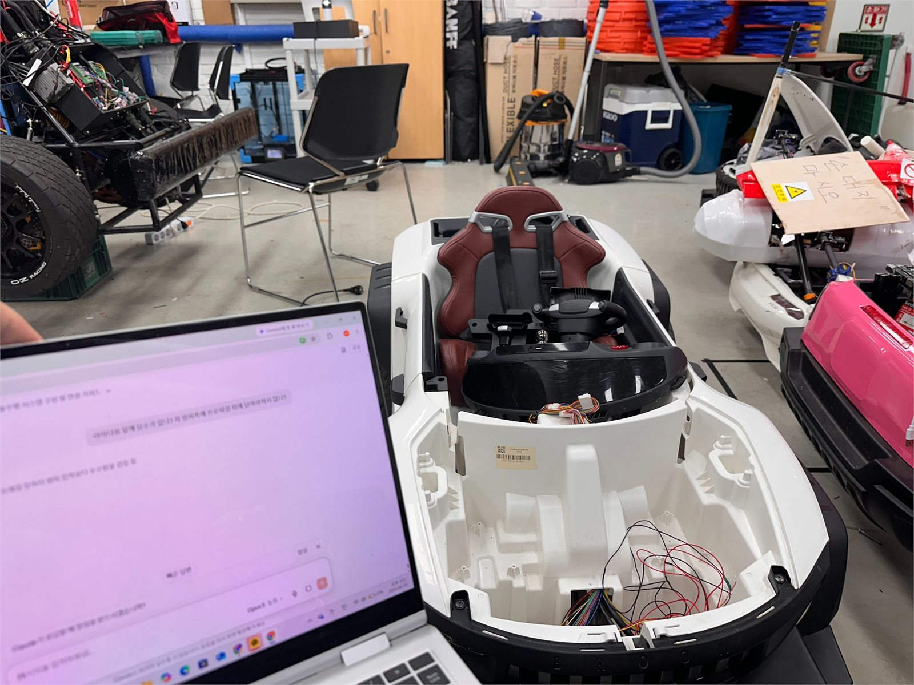

### 임베디드 제어와 구동

최종 실차 제어 보드는 **NUCLEO-H723ZG**다. `firmware/nucleo_h743zi2/`는 별도 이식용 C 모듈이며 최종 차량 구성과 혼동하지 않는다.

- MDD20A: 엔코더가 없는 후륜 구동모터의 PWM/DIR 출력
- MD10C: 조향모터 구동
- 조향 위치 센서: NUCLEO ADC 입력으로 실제 조향각 피드백
- NUCLEO: 조향각 PID, 출력 제한, 명령 watchdog, fault feedback
- Linux 주 컴퓨터: GNSS/LiDAR 속도를 이용한 외부 속도 제어와 최종 duty 계산

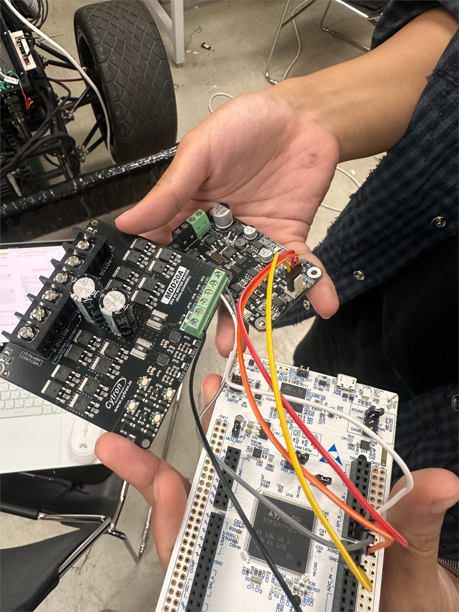

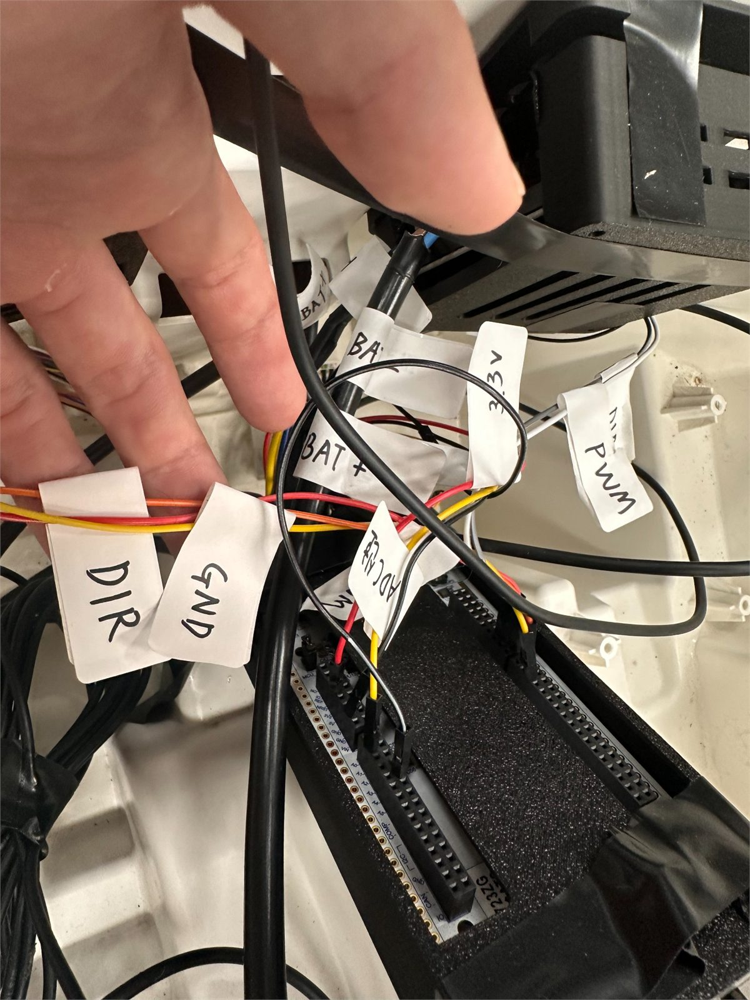

### 전력 시스템

차량 구동용 24V 계통과 컴퓨터·센서용 전원 계통을 분리했다. 별도 12V 100Ah LiFePO₄ 배터리와 600W 인버터는 노트북 및 USB 센서 허브 전원에 사용했고, 구동모터와 조향모터는 차량 배터리·모터 드라이버 계통을 사용했다.

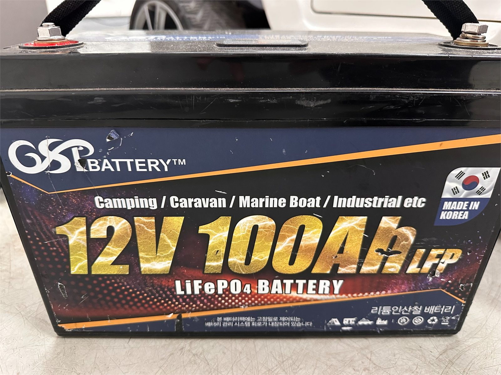

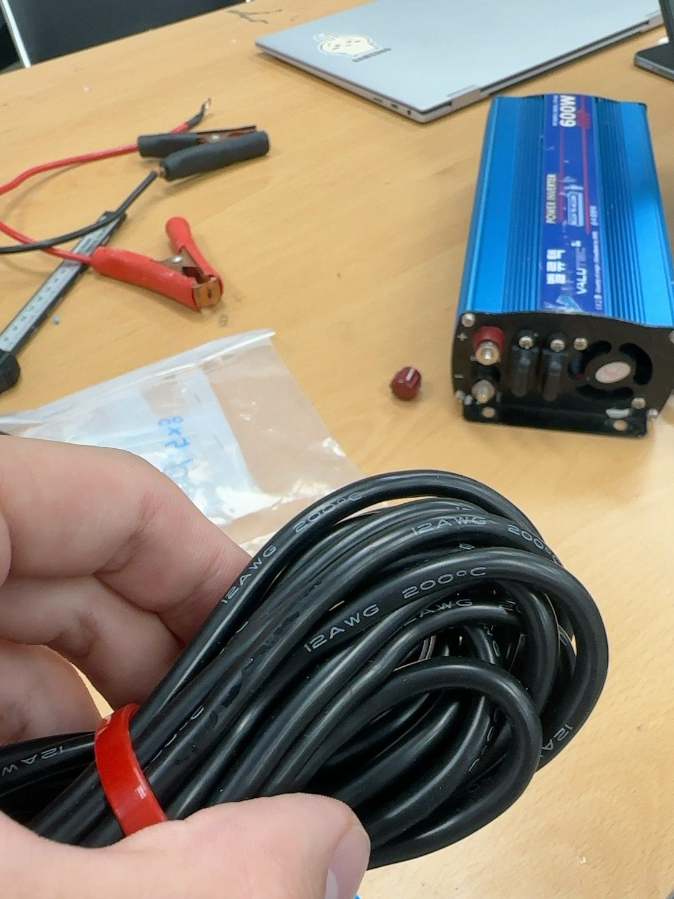

## 듀얼 안테나 RTK GNSS

UM982의 주 안테나 위치와 두 안테나 사이 baseline heading을 함께 사용했다. NTRIP client가 보정 서버에서 받은 RTCM bytes를 `/gnss/rtcm`으로 전달하고, UM982 serial node가 보정정보를 수신기에 주입하면서 NMEA position·speed·heading을 파싱한다.

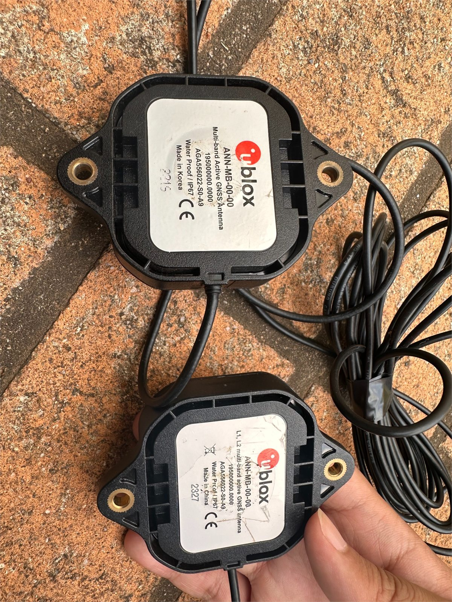

처리 과정은 다음과 같다.

1. RTK 보정 상태를 `NONE`, `SINGLE`, `DGPS`, `RTK FLOAT`, `RTK FIXED`로 구분한다.
2. 진북 기준 시계방향 heading을 ROS ENU yaw로 변환한다.
3. 고정 datum을 기준으로 위도·경도·고도를 local ENU로 투영한다.
4. ANT1에서 `base_link`까지의 lever arm과 장착 offset을 적용한다.
5. position·velocity·heading freshness와 covariance를 포함해 pose와 속도를 발행한다.

```text
yaw_enu = normalize(pi/2 - heading_true + heading_mount_offset)
base_link = ANT1 position - rotate(yaw_enu, antenna lever arm)
```

실제 caster host, mountpoint, ID와 비밀번호는 공개 저장소에 포함하지 않는다. [`ntrip_private.example.yaml`](ros2_ws/src/hl_ku_core/config/ntrip_private.example.yaml)만 제공하며 개인 설정 파일은 `.gitignore`로 제외한다.

## 전역경로와 Stanley 추종

현장에서 RTK FIX와 heading을 확인한 뒤 waypoint를 기록하고, CSV 전역경로에 누적 거리, 목표 속도, 진행방향, 미션 구역, FSM event를 함께 저장했다. Course 07은 8개 주차·종점 조합과 구역별 시험 경로를 동일한 기준 좌표계로 관리한다.

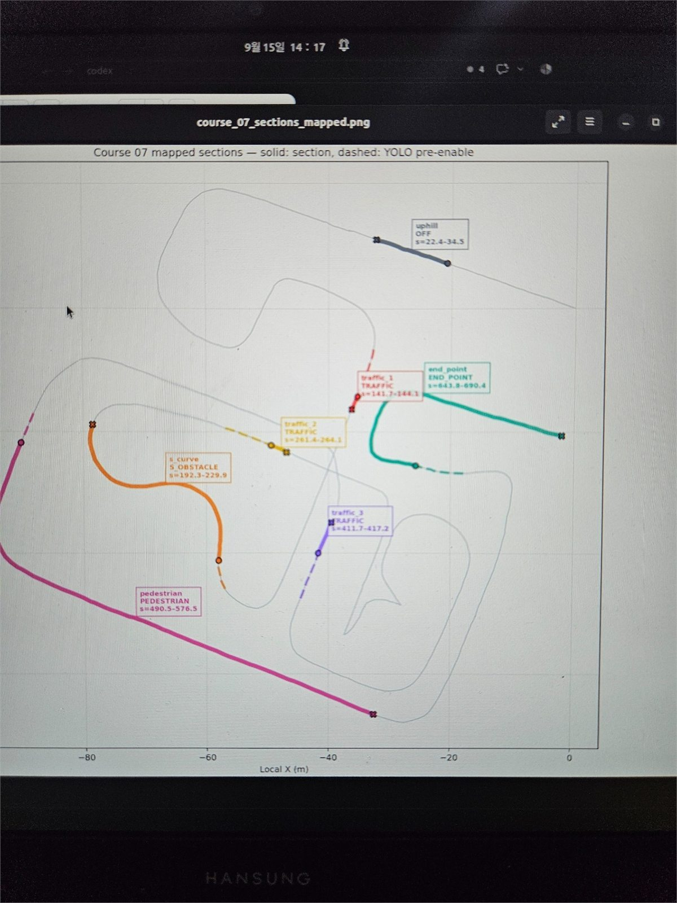

최종 전진 경로의 조향 명령은 직선·곡선 모두 **Stanley 100%**를 사용한다. 코드에서 Pure Pursuit 조향값과 경로 곡률도 계산하지만 Foxglove/현장 분석용 진단 토픽일 뿐, 전진 `/planning/path_command`에는 혼합하지 않는다.

```text
heading_error = route_heading - vehicle_heading
cross_track_term = atan2(k · cte, |speed| + softening)
steering = clamp(heading_error + cross_track_term)
```

짧은 waypoint 잡음이 조향 명령으로 바로 들어가지 않도록 1.0m baseline으로 경로 tangent를 구한다. 경로 전환점에서는 진행방향이 다른 run을 분리하고 정지 상태를 확인한 후 다음 phase로 넘어간다.

## 인지·판단·미션

| 기능 | 코드에 구현된 내용 | 공개 자료로 확인 가능한 범위 |
| --- | --- | --- |
| 카메라 | 차선 offset/heading, 정지선, 신호등, 종점 차선 신호 | baseline OpenCV와 YOLO gate/overlay 코드 |
| LiDAR | 장애물 거리, dummy stop, S자 local detour, 주차 route 선택 | scan clustering, map projection, detour candidate 코드 |
| 경사 | 접근·정지·hold·재출발 상태 | CSV `HILL_STOP` event와 adaptive hill-hold 코드 |
| 신호등 | stop-line 접근, red/unknown 정지, green 확인 후 출발 | `TRAFFIC_APPROACH/WAIT` FSM과 투표 기반 gating |
| S자 | 장애물 후방까지 확장한 local detour와 재합류 | 전역경로 유지형 우회 candidate 구현 |
| 주차 | T/평행 주차 route 후보 선택과 전·후진 phase | 2×2×2 route variant와 방향 전환 안전 정지 |
| 종점 차선 | 카메라 신호 기반 final route 선택 | 두 종점 variant의 제한된 lateral transition |

구현 여부와 본선 성공 여부는 다르다. 제공된 코드·설정·사진만으로 각 미션의 본선 성공을 입증할 수 없어, 이 저장소는 모든 미션을 성공적으로 수행했다고 주장하지 않는다.

## TUI와 Foxglove

현장 TUI는 한 터미널에서 datum 측정, 시나리오 선택, 목표 속도·PWM 설정, MCAP 기록, Foxglove 연결과 중지 절차를 관리한다.

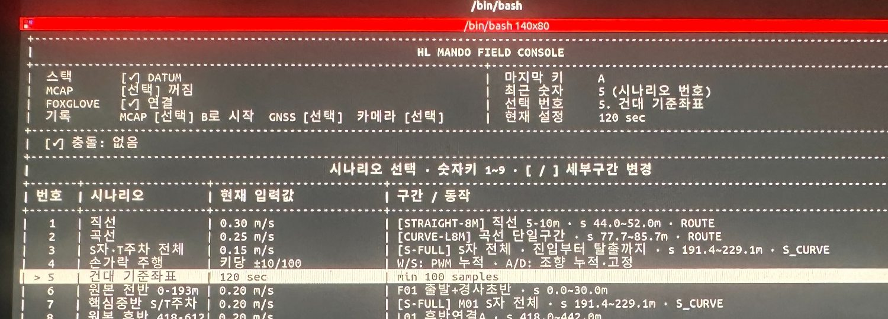

Foxglove 대시보드는 8개 전역경로, waypoint 미션 구간, RTK 상태, 속도·조향·CTE, 카메라와 FSM을 한 화면에서 비교한다. 아래 이미지는 **rosbag replay 통합 점검 화면**이며 실제 본선 완주 장면이 아니다.

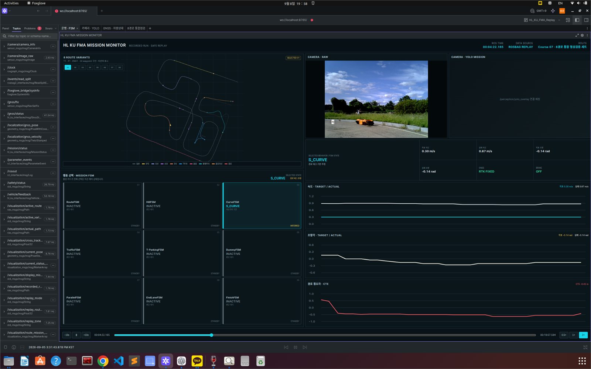

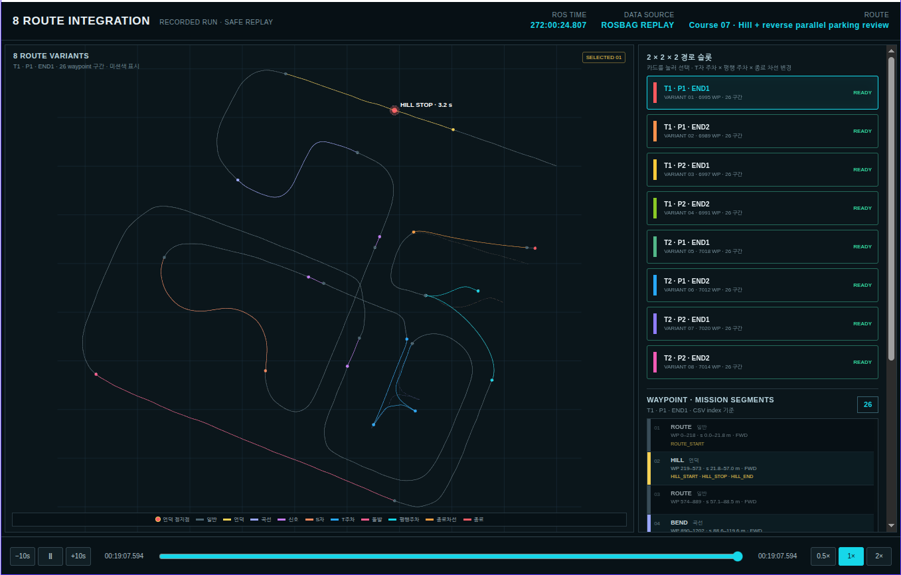

## 실차 시험과 대회 과정

```text
차체 분해·부품 확인
  → 모터 드라이버·NUCLEO 단품 시험
  → 전원 계통 분리 및 배선
  → GNSS 안테나·카메라·LiDAR 장착
  → 조향 피드백과 차륜상승 구동 시험
  → RTK datum·waypoint 기록
  → 직선/곡선/S자 구간별 실외 시험
  → TUI·Foxglove 통합 점검
  → 대회 현장 운용
```

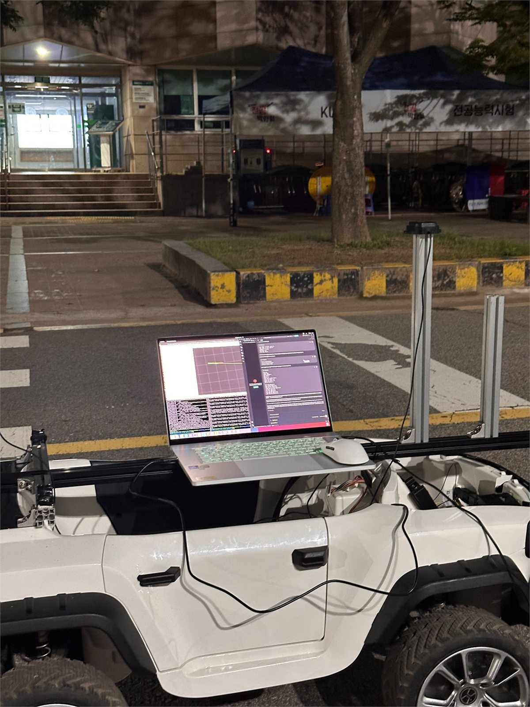

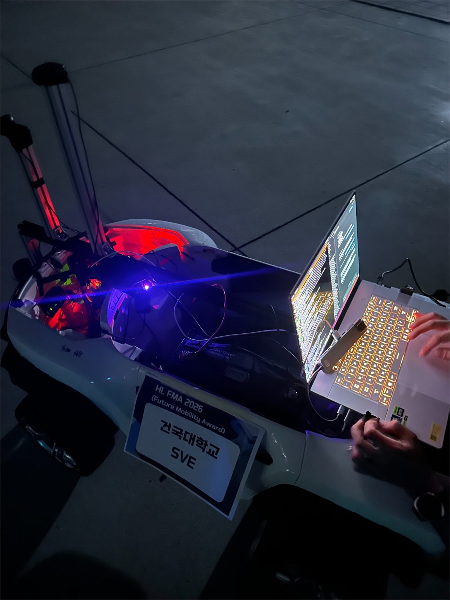

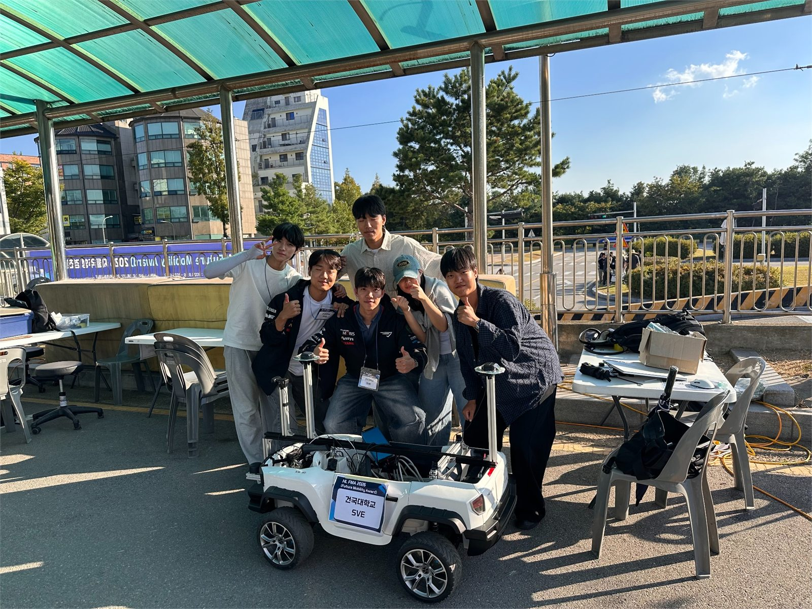

## 문제 분석과 배운 점

본선 두 번의 시도에서 좌회전 신호등 구간을 지난 뒤 직선으로 복귀할 때 좌우 오실레이션이 커졌고 연석에 충돌했다. 주행 원본 로그가 없어 단일 원인으로 확정하지 않고 다음 가설을 남긴다.

| 가설 | 확인할 데이터 | 개선 방향 |
| --- | --- | --- |
| GNSS heading 갱신·위치추정 지연 | heading/pose age, sensor timestamp, command latency | 지연을 포함한 replay, 시간 정렬, stale threshold 검증 |
| 실제 속도와 Stanley 파라미터 불일치 | actual/target speed, CTE, heading error, steering command | 속도 구간별 gain sweep와 폐루프 주행 비교 |
| CSV의 작은 굴곡과 곡선→직선 전환 | waypoint curvature, 1.0m tangent, transition 구간 | spline/곡률 제한, 직선 정렬 구간 재기록 |
| 실제 조향 응답과 명령 차이 | target/actual steering, slew rate, ADC feedback | 좌우 응답 실측, deadband·rate limit 보정 |

이번 사례의 핵심 교훈은 제어기 이름보다 **센서 갱신률, 경로 품질, 속도, 조향 응답을 같은 시간축에서 검증하는 것**이 중요하다는 점이다. 다음 시험에서는 MCAP을 항상 수집하고 곡선 이탈 전후의 pose, CTE, heading error, target/actual steering을 재생 가능한 형태로 남겨 가설을 구분해야 한다.

## 안전과 공개 원칙

- 기본 설정은 `drive_enabled: false`, `route_calibrated: false`다.
- 보정 기록, 실측 경로, 센서 freshness와 MCU feedback이 preflight를 통과해야 구동을 허가한다.
- NTRIP 계정·토큰·비밀번호는 저장소에 포함하지 않는다.
- 제공 사진은 EXIF를 제거하고 웹 크기로 다시 인코딩했다.
- 팀원이 식별되는 사진은 사용자로부터 게시 허가를 받았다는 확인을 바탕으로 포함했다.
- 원본 팀 저장소의 Git 이력은 덮어쓰지 않았으며 이 저장소는 별도 공개 snapshot으로 만들었다.

## 저장소 구조

```text
HL_FMA_2026/
├── docs/                         아키텍처·시험·설정 문서와 포트폴리오 사진
├── firmware/
│   ├── nucleo_h723zg/            최종 실차 펌웨어·배선 자료
│   └── nucleo_h743zi2/           별도 이식용 C 모듈
├── operations/                   설치·경로 준비·TUI·replay 스크립트
└── ros2_ws/src/
    ├── hl_ku_interfaces/         ROS 2 사용자 정의 메시지
    ├── hl_ku_core/               GNSS·인지·미션·제어·안전·MCU 통신
    └── hl_ku_foxglove/           Foxglove 확장과 replay 시각화
```

## 빌드와 실행

```bash
git clone https://github.com/juuny0317-cmd/HL_FMA_2026.git
cd HL_FMA_2026
./operations/setup_new_pc.sh
```

수동 빌드:

```bash
cd ros2_ws
source /opt/ros/humble/setup.bash
rosdep install --from-paths src --ignore-src -r -y
colcon build --symlink-install
source install/setup.bash
```

실차 구동 전에 [`docs/SETUP_NEW_PC.md`](docs/SETUP_NEW_PC.md), [`docs/COMMISSIONING.md`](docs/COMMISSIONING.md), [`docs/GLOBAL_ROUTE_TEST.md`](docs/GLOBAL_ROUTE_TEST.md)를 순서대로 확인한다. 예시 경로와 미측정 calibration 값을 임의로 `true`로 바꾸지 않는다.

## 출처

- 팀 원본: [`yunny22/HL_KU`](https://github.com/yunny22/HL_KU)
- 가져온 기준 commit: `c4532e6b316e9a0e1b5229030d9beba862f0602c`
- 공동 개발: HL KU / Team SVE
- 포트폴리오 재구성 및 공개 저장소: [`juuny0317-cmd/HL_FMA_2026`](https://github.com/juuny0317-cmd/HL_FMA_2026)

원본 저장소와 팀 공동 개발 사실을 보존하면서, 공개 가능한 코드·문서·사진만 별도 저장소에 정리했다.
