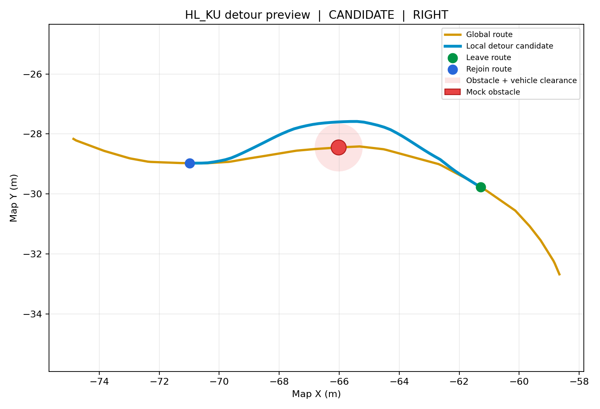

# 라이다 없이 짧은 우회경로 미리보기

이 코드는 전역경로 CSV의 `S_OBSTACLE` 전진 구간에서 가상 원형 장애물 하나를
설정하고, 원본 경로를 잠시 벗어났다가 다시 합류하는 **후보 경로**를 만든다.
원본 경로 CSV는 수정하지 않는다. 이 문서의 가상 장애물 미리보기는
조향·모터 명령에 연결되지 않는다. 별도의 **실시간 후보 조향 연결**은 아래에
설명하며, 기본적으로 꺼져 있다.

## 실행

Ubuntu 22.04 / ROS 2 Humble에서 다음을 실행한다.

```bash
cd ~/HL_KU/ros2_ws
source /opt/ros/humble/setup.bash
colcon build --symlink-install --packages-select hl_ku_core
source install/setup.bash
ros2 launch hl_ku_core detour_preview.launch.py
```

RViz 창이 자동으로 열리며 노란색은 원본 전역경로, 하늘색은 짧은 우회 후보,
빨간 원은 가상 장애물, 초록 점은 이탈점, 파란 점은 재합류점이다.
RViz가 설치되지 않은 PC에서 토픽만 시험하려면 `open_rviz:=false`를 붙인다.



별도 터미널에서 상태를 확인한다.

```bash
source /opt/ros/humble/setup.bash
source ~/HL_KU/ros2_ws/install/setup.bash
ros2 topic echo /planning/local_detour_status
```

기본 예시는 `course_07_vehicle.csv`의 경로거리 `s=210 m`에 가상 장애물을
놓고, `s=200 m`에서 계획한다. `CANDIDATE`가 나오면 우회경로가 생성된 것이다.
다른 지점과 장애물 좌우 위치도 시험할 수 있다.

```bash
ros2 launch hl_ku_core detour_preview.launch.py \
  progress_s_m:=200.0 obstacle_s_m:=210.0 obstacle_lateral_m:=0.4
```

실행 중에도 다른 터미널에서 가상 장애물의 경로거리와 좌우 위치를 바꾸면
RViz 후보 경로가 약 0.5초 후 갱신된다.

```bash
ros2 param set /local_detour_preview preview_obstacle_s_m 214.0
ros2 param set /local_detour_preview preview_obstacle_lateral_m -0.4
```

ROS 없이 한 장의 그림으로 저장하려면 `python3-matplotlib`가 설치된 PC에서
다음을 실행한다. 실제 planner 함수가 만든 점으로 그림을 그린다.

```bash
python3 ~/HL_KU/operations/plot_detour_preview.py
```

결과는 `docs/images/local_detour_preview.png`에 저장된다.

RViz에서 `Fixed Frame=map`으로 설정하고 다음 디스플레이를 추가한다.

| Display | 토픽 | 의미 |
|---|---|---|
| Path | `/planning/reference_path_preview` | 기존 전역경로 |
| Path | `/planning/local_detour_candidate` | 합류하는 짧은 우회 후보 |
| MarkerArray | `/planning/detour_preview_markers` | 가상 장애물의 크기와 이탈·재합류점 |

별도의 `/planning/detour_preview_obstacles` PoseArray는 장애물 **중심만** 담는다.
충돌 검사는 기본 반지름 0.25 m에 차량 반폭 0.35 m와 여유 0.20 m를 더한 값으로
수행한다.

## 현재 적용한 제한

- `S_OBSTACLE`이고 전진·비정지 경로인 짧은 구간에서만 생성한다. 미션 경계,
  정지점, 전진/후진 전환을 가로지르지 않는다.
- 전역경로에서 최대 1.70 m의 회피 복도를 **가정**하고, 차량 반폭/안전 여유를
  뺀 범위 안에서만 차량 중심을 옮긴다. 1.70 m는 경기장 실측값이 아니다.
- 전방 스캔으로 얻은 장애물 원을 진행방향 뒤쪽으로 1.3 m 연장한 캡슐 형태로
  간주한다. 경로 횡오프셋은 장애물 후단까지 유지하고 그 뒤부터 재합류한다.
- 경로 샘플 사이의 선분과 연장된 모든 장애물 영역의 거리를 검사하고, 곡률
  상한도 검사한다.
  시작점이 너무 가까우면 `TOO_CLOSE_OR_ROUTE_END`, 공간이 없으면
  `NO_SAFE_DETOUR`로 끝나며 빈 경로를 발행한다.
- 이 검사는 **알고 있는 원형 장애물만** 다룬다. 보이지 않는 영역, 차선 경계,
  움직이는 물체, GNSS 오차, 조향 지연 및 제동 거리를 보장하지 않는다.

## 나중에 라이다 연결 시

장애물 감지 파라미터는 `system.yaml`에서 전방 8 m(`obstacle_trigger_m`),
소프트웨어 측정 범위 12 m(`detection_range_m`)로 설정했다. 후보 경로는
장애물 중심 약 5 m 앞에서 이탈하므로, 경로 위 장애물이 8 m 앞에서 안정적으로
발견된다면 약 3 m의 계획 여유가 생긴다. 이 거리는 실차 측정값이 아니며,
장애물 크기·LiDAR 설치 위치·센서 지연·차량 속도에 따라 다시 검증해야 한다.
이 거리 설정만으로 실시간 회피가 이루어지지는 않는다.

실시간 모드(`preview_mode=false`)는 `/planning/route_s`와
`/planning/obstacle_discs_map`(`hl_ku_interfaces/ObstacleArray`, `frame_id=map`)을
받는다. `scan_obstacle_mapper`가 실제 `/scan` 군집을 GNSS 위치로 지도에 옮기고
보이는 군집 폭에서 각 장애물의 반지름을 구한다. 최소 반지름은 0.40 m,
추가 여유는 0.10 m다. 장애물이 없을 때도 빈 `ObstacleArray`를 주기적으로
발행한다. 두 입력 중 하나가 끊기면 후보 경로를 비운다. 기존
`/planning/obstacles_map` `PoseArray`는 중심점 표시용으로 유지한다.

실시간 모드는 미리보기와 분리된
`/planning/live/local_detour_candidate` 및
`/planning/live/local_detour_status`를 발행한다. 미리보기의 가상 장애물
토픽을 실행해도 차량 조향에 연결되지 않도록 분리했다. 생성된 실시간 후보는
이탈점에 도착해도 재합류점까지 유지하며, 새로 관측한 장애물이 경로를 막거나
입력이 끊기면 후보를 비운다.

## 실시간 조향 연결(기본 비활성)

건대 TUI의 S자 전체 구간은 실시간 회피 후보를 미션 관리자에 연결한다.
먼저 구동 출력 없이 같은 경로와 센서 토픽을 확인하려면 다음처럼 실행한다.
`S_OBSTACLE` 전진 구간에서만 후보를 사용하며, 8 m 조기 감지 후 속도를
최대 0.30 m/s로 제한한다. 이탈점 전까지 전역경로 조향을 유지하고,
이탈점 근처부터 후보 경로의 Stanley 조향으로 전환한다. 이때 기존
라이다 틈새 조향값은 더하지 않는다. 재합류 뒤에는 전역경로 조향으로 돌아간다.
회피에 들어간 뒤 후보나 GNSS/LiDAR 입력이 끊기거나 경로에서 크게 벗어나면
정지 명령을 낸다. 라이다 입력이 끊기면 S 구간에서도 정지한다.
장애물이 5.5 m 안에 왔는데 안전한 후보가 없어도 정지한다.

```bash
ros2 launch hl_ku_core gps_route_test.launch.py \
  route_file:=/절대경로/건대에_배치한_S자.csv \
  drive_enabled:=false actuator_bridge_enabled:=false \
  use_lidar_pipeline:=true start_lidar_driver:=false \
  use_local_detour_planner:=true lidar_geometry_verified:=true \
  enable_local_detour_steering:=false
```

이 명령은 별도로 `/scan` 드라이버가 실행 중일 때 쓴다. 실제 주행은 TUI의
S자 시나리오가 드라이버와 회피 조향까지 함께 준비한다.

건대 TUI의 3번 `S-FULL`과 7번 `M01 S자 전체`는 측정된 LiDAR 위치
`x=1.25 m, y=0 m`, yaw `-132.68 deg`를 사용해 실시간 지도 투영과 회피 조향을
함께 켠다. 다른 시나리오와 단독 launch의 기본값은 꺼져 있다. 실제 주행 전
RTK 위치, 지도 위 장애물 위치, 회피 후보 및 주행 가능 폭을 정지 상태에서
확인한다. `CANDIDATE`는 후보가 있다는 뜻이며 공간 경계까지 확인한 결과는 아니다.
