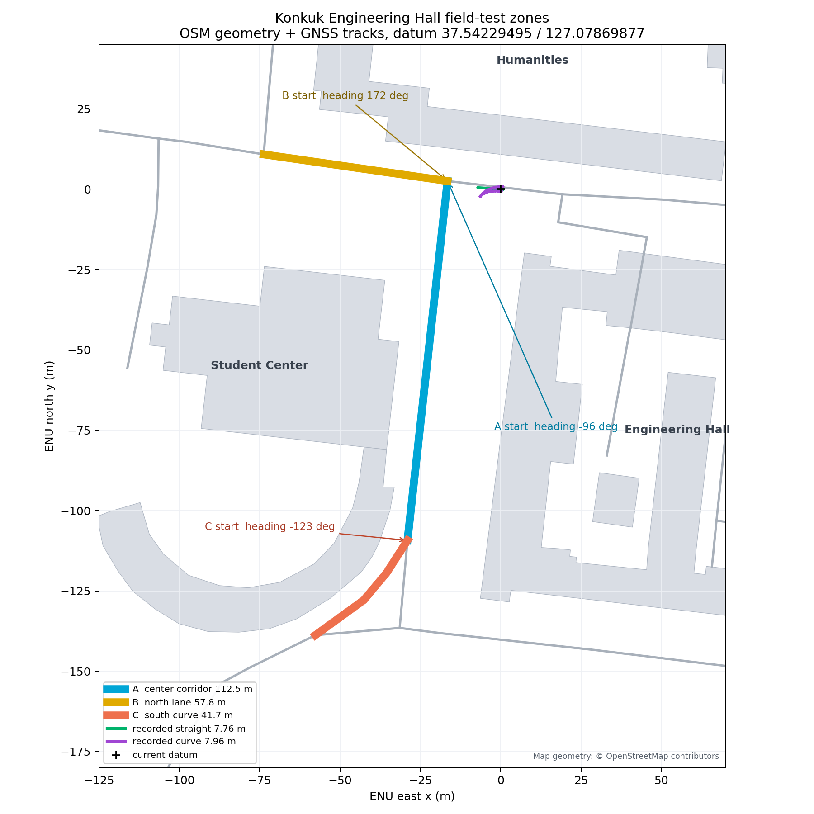

# 건대 공학관 앞 course 07 구간별 시험 계획

## 계산에 사용한 자료

- 경기장 원본: `course_07_vehicle.csv`, 1,742점, 총 690.37 m
- Foxglove 대표 통합경로: `course_07_mission.csv`의 `p1_t1_f1`, 총 697.80 m
- 건대 직선 기록: `mando_s01_20260914_211836`
- 건대 곡선 기록: `mando_s02_20260914_212632` 첫 번째 MCAP
- 건대 datum: 위도 37.54229495079241, 경도 127.07869877297115
- 현장 길이: OpenStreetMap 도로 중심선과 건물 외곽을 datum ENU로 투영해 계산

통합경로는 T자·평행주차·종료차선 분기 때문에 원본 경로와 총 길이가 조금
다르다. 이 문서의 TUI 조각은 실제 rosbag에서 만든 `course_07_vehicle.csv`의
좌표를 축소하지 않고 자른다. 회전과 평행이동만 적용한다.

## 공학관 앞에서 쓸 세 구역

| 구역 | 지도상 길이 | 시험에 잡을 길이 | 추천 형상 | 시작점과 방향 |
| --- | ---: | ---: | --- | --- |
| A 중앙통로 | 112.5 m | 약 100 m | 직선, 완만한 곡선, 횡폭 8 m 이하 | 북단 약 `(-16.5, 2.5)`, 남향 `-96°` |
| B 북측 가로 | 57.8 m | 약 48 m | 8~30 m 기준 반복시험 | 동단 약 `(-16.5, 2.5)`, 서향 `172°` |
| C 남측 교차부 | 41.7 m 곡선 | 약 30×30 m 공간 확인 | 90도 곡선, S자, 횡폭 8 m 초과 | 중앙통로 남단 약 `(-29.0, -109.3)`, 남서향 `-123°` |

학생회관 동측 외벽과 공학관 서측 외벽 사이 지도상 간격은 약 25.3 m다. 보행로,
화단, 주차차량을 제외한 실제 포장 폭은 현장에서 콘 또는 줄자로 다시 확인한다.
TUI 설명의 `풋프린트 길이×횡폭` 전체가 포장 안에 들어오도록 차를 세운다.
양 끝 5 m는 출발 준비와 정지 여유로 남기는 기준으로 위 시험 길이를 정했다.

## rosbag에서 확인한 건대 기준 성능

| 시험 | 기준경로 | 실제 이동 | 활성 주행시간 | CTE RMS | CTE 최대 | Stanley 조향 최대 |
| --- | ---: | ---: | ---: | ---: | ---: | ---: |
| 직선 | 7.75 m | 약 7.76 m | 9.3 s | 0.019 m | 0.042 m | 0.065 rad |
| 곡선 | 7.56 m | 약 7.96 m | 9.6 s | 0.107 m | 0.165 m | 0.263 rad |

곡선의 실제 이동거리는 GNSS 점 사이 누적거리이므로 경로 스케일 오차와 같은
뜻은 아니다. 이후 비교에서는 같은 지표인 CTE RMS·최대값과 조향 명령을 함께
본다. 짧게 끝난 `mando_s02_20260914_212601`은 약 0.89 m만 움직인 중단 시험이라
기준에서 제외했다.

## 경기장 전체 구간 길이

Foxglove 대표 통합경로의 연속 FSM 구간은 다음과 같다.

| 순서 | 구간 | 누적 s | 길이 |
| ---: | --- | --- | ---: |
| 1 | 출발 ROUTE | 0.0~21.8 m | 21.8 m |
| 2 | HILL | 21.8~57.0 m | 35.2 m |
| 3 | 연결 ROUTE | 57.1~88.5 m | 31.4 m |
| 4 | BEND | 88.6~119.6 m | 31.0 m |
| 5 | 신호1 접근 ROUTE | 119.7~140.5 m | 20.8 m |
| 6 | TRAFFIC 1 | 140.6~142.9 m | 2.3 m |
| 7 | S자 접근 ROUTE | 142.9~191.4 m | 48.4 m |
| 8 | S_CURVE | 191.4~229.1 m | 37.7 m |
| 9 | 신호2 접근 ROUTE | 229.2~260.0 m | 30.8 m |
| 10 | TRAFFIC 2 | 260.0~263.3 m | 3.2 m |
| 11 | T자 접근 ROUTE | 263.3~284.9 m | 21.5 m |
| 12 | T_PARK | 284.9~329.4 m | 44.5 m |
| 13 | 연결 ROUTE | 329.4~407.4 m | 78.0 m |
| 14 | TRAFFIC 3 | 407.4~413.5 m | 6.0 m |
| 15 | 돌발 접근 ROUTE | 413.5~507.5 m | 93.9 m |
| 16 | DUMMY | 507.5~572.3 m | 64.8 m |
| 17 | 평행주차 접근 ROUTE | 572.3~607.6 m | 35.3 m |
| 18 | PARALLEL_PARK | 607.7~655.6 m | 47.9 m |
| 19 | 종료 접근 ROUTE | 655.7~673.2 m | 17.5 m |
| 20 | END_LANE | 673.3~696.1 m | 22.9 m |
| 21 | 결승 통과 ROUTE/FINISH | 696.2~697.8 m | 1.6 m |

평행주차 P2를 선택한 T1/F1 전체 길이는 약 712.42 m다. 위 구간 표는
P1/T1/F1 기준이며 다른 분기의 정확한 구간 거리는 통합 CSV를 따른다.

## TUI에 넣은 전체 원본 조각

`6`, `7`, `8`, `9` 안에서 `[`와 `]`로 아래 구간을 고른다. 7번의 S자와
T자 주차는 FSM 시작·종료 경계를 기준으로 전체를 보존했다. 공간 크기는
운영자가 현장에서 정하며 TUI에 표시된 풋프린트를 사용한다.

| TUI | 조각 | 원본 s | 실제 길이 | 배치 풋프린트 | 추천 |
| --- | --- | ---: | ---: | ---: | --- |
| 6 | F01 출발+경사초반 | 0~30 | 29.9 m | 29.5×0.4 m | A |
| 6 | F02 경사후반 | 30~58 | 27.3 m | 26.5×3.4 m | A |
| 6 | F03 굴절접근A | 58~74 | 15.8 m | 9.3×10.1 m | C |
| 6 | F04 굴절접근B | 74~90 | 15.5 m | 10.1×9.6 m | C |
| 6 | F05 굴절전반 | 90~105 | 14.8 m | 8.5×8.9 m | C |
| 6 | F06 굴절후반 | 105~121 | 15.7 m | 9.2×8.7 m | C |
| 6 | F07 신호1 접근 | 121~144 | 22.4 m | 11.6×14.8 m | C |
| 6 | F08 S접근 직선 | 144~169 | 24.6 m | 24.6×0.4 m | A |
| 6 | F09 S접근 회차 | 169~193 | 23.6 m | 11.7×11.1 m | C |
| 7 | M01 S-FULL | 191.386~229.060 | 37.67 m | 20.83×22.40 m | 현장 선택 |
| 7 | M02 신호2 접근 전체 | 229.160~260.032 | 30.87 m | TUI 표시 | 현장 선택 |
| 7 | M03 신호2 FSM 전체 | 260.032~263.254 | 3.22 m | TUI 표시 | 현장 선택 |
| 7 | M04 T주차 접근 전체 | 263.325~284.850 | 21.53 m | TUI 표시 | 현장 선택 |
| 7 | M05 T1-FULL | 284.866~329.397 | 44.53 m | 17.36×8.21 m | 현장 선택 |
| 7 | M06 T2-FULL | 284.969~331.680 | 46.71 m | 17.30×10.08 m | 현장 선택 |
| 7 | M07 중간 연결 전체 | 329.416~407.377 | 77.96 m | 32.54×25.75 m | 현장 선택 |
| 7 | M08 신호3 FSM 전체 | 407.434~413.476 | 6.04 m | 6.03×0.26 m | 현장 선택 |
| 8 | L01 후반연결A | 418~442 | 23.9 m | 10.0×17.8 m | C |
| 8 | L02 후반직선 | 442~466 | 23.6 m | 23.5×0.7 m | A |
| 8 | L03 후반연결C | 466~490 | 23.4 m | 10.0×17.6 m | C |
| 8 | L04 후반연결D | 490~512 | 21.5 m | 19.1×6.3 m | A |
| 8 | L05 돌발전반 | 512~534 | 21.7 m | 21.0×5.0 m | A |
| 8 | L06 돌발중반 | 534~555 | 20.8 m | 20.8×0.4 m | A |
| 8 | L07 돌발후반 | 555~577 | 21.4 m | 21.4×0.5 m | A |
| 8 | L08 평행접근 곡선 | 577~595 | 17.5 m | 8.9×12.0 m | C |
| 8 | L09 평행접근 직선 | 595~612 | 16.6 m | 16.6×0.8 m | A |
| 9 | E01 평행본선A | 612~628 | 15.5 m | 15.2×1.7 m | A |
| 9 | E02 평행본선B | 628~644 | 15.5 m | 12.2×9.0 m | C |
| 9 | E03 종료접근 회차 | 644~663 | 18.6 m | 7.7×11.3 m | C |
| 9 | E04 종료차선 | 663~681 | 17.7 m | 16.7×5.3 m | A |
| 9 | E05 결승 직선 | 681~690.4 | 8.7 m | 8.6×0.4 m | B |

원본 parking overlay 자체는 전체 경기 운영용 `drive_ready=false` 상태다.
TUI의 `T1-FULL`과 `T2-FULL`은 그중 T_PARK 구간만 추출해 시험 속도를 넣고,
전진→후진과 후진→전진 경계에서 정지 확인 후 0.75초 유지하는 로직을 추가한
감독 시험 시나리오다. 전진과 후진 모두 Stanley 100%로 조향한다.

## 현장 실행 순서

1. B구역에서 `1` 직선과 `2` 곡선을 각각 반복해 기존 CTE가 재현되는지 본다.
2. `3`을 누르고 `S-FULL`, `T1-FULL`, `T2-FULL` 중 시험할 전체 구간을
   `[`/`]`로 고른다. TUI에 표시된 풋프린트가 확보되는 위치에 차를 둔다.
3. `6`부터 `9`까지 번호를 고르고 `[`/`]`로 조각을 순서대로 이동한다.
4. TUI 설명에 A가 나오면 중앙통로, B는 북측 가로, C는 남측 교차부에 차를 둔다.
5. 차를 시작 방향에 맞춘 다음 `R`을 누른다. `R`은 매번 선택한 원본 조각을
   현재 RTK 위치와 차량 방향에 다시 배치한다.
6. Foxglove의 청록색 기준경로가 포장 안에 전부 들어오는지 본 뒤 `Space`로
   출발한다. MCAP이 필요한 회차만 출발 전에 `B`를 누른다.
7. 종료 후 `S`로 스택을 끝내고 다음 조각으로 이동한다.

처음에는 0.15~0.20 m/s로 곡선과 S자를 확인하고, 같은 시작 위치에서 CTE와
조향이 반복되는 것을 확인한 뒤 속도를 올린다. 직선 비교 기준은 현재 기록인
RMS 0.019 m, 곡선 비교 기준은 RMS 0.107 m다. 이 값은 출발 차이와 GNSS 상태를
함께 기록해 회차끼리 비교한다.
